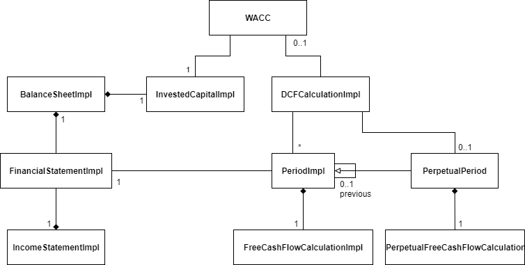
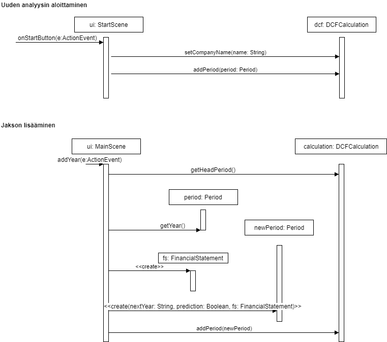

**Aihe:** Työkalulla käyttäjä tekee ns. "discounted cash-flow" analyysin. Käytännössä tämä tarkoittaa yrityksen tilinpäätöksiin perustuva yrityksen arvon arviointia.

Käyttäjä lisää tiedot muutamasta vanhasta tilinpäätöksestä, ja tekee arvion muutamasta tulevasta. Käyttäjä tekee sitten vielä arvion yrityksen jatkuvasta kehityksestä, ja pääoman kustannuksesta (WACC, Weighted Average Cost of Capital). Tämä perusteella voidaan tehdä arvio yrityksen arvosta. Jos osakkeiden määrä on tiedossa, voidaan myös arvioida yrityksen osakkeen hintaa, ja sen perusteella päätellä jos pitäisi tehdä osto-, pito-, vai myyntisuositus.

**Käyttäjät:** Kuka vaan

### Toiminnot
- Aloita uusi analyysi
- Lisää WACC laskentaan vaaditut arvot
- Lisää tilikausi
- Lisää arvio tulevasta tilikaudesta
- Lisää arvio jatkuvasta kehityksestä
- Muokkaa osakkeiden lukumäärää
- Suorita laskenta

### Linkkejä
- https://en.wikipedia.org/wiki/Discounted_cash_flow
- https://en.wikipedia.org/wiki/Weighted_average_cost_of_capital

### Luokkakaavio

### Rakennekuvaus
Ohjelmassa tehdään diskontattu kassavirta-analyysi, jonka keskipisteenä on luokka DCFCalculationImpl. Analyysin tekemiseksi siihen lisätään jaksoja, eli PeriodImpl luokkien ilmentymiä. Lisäksi tarvitaan pääomakustannuslaskelma WACC. Laskelmaan lisätään myös PerpetualPeriod ilmentymä jolla lasketaan jatkuvan kehityksen kassavirrat.

Jokaiseen jaksoon kuuluu tilinpäätös FinancialStatementImpl. Tilinpäätökseen kuuluu tuloslaskelma, IncomeStatementImpl, ja tase BalanceSheetImpl. Taseesta tehdään myös pääomalaskelma InvestedCapitalImpl.

Kun DCFCalculationImpl luokalla on kaikki tarvittavat komponentit voidaan jaksoille luoda FreeCashFlowCalculationImpl jolla lasketaan kassavirrat. Jatkuvalle kaudelle luodaan PerpetualFreeCashFlowCalculation. Laskelmien summasta muodostuu yrityksen arvo-arvio.

### Sekvenssikaaviot
